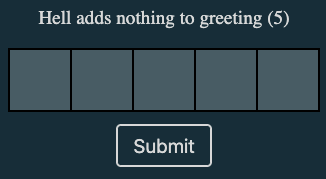

# Single Word "Crossword" Puzzle

This is a project to create a simple, framework-less solution to having a "daily clue" type puzzle easily embedded in a website.

The core functionality lies in `src/clue.ts`, the rest of the project largely serves as a demo.

## typescript code

### generateInteractiveCrossword

This function looks for an element with the id "crossword-container" and creates the html elements to generate the answer box which looks like the following:

<div style="text-align: center;">
  
  <br/>
  <br/>
</div>

```ts
export const generateInteractiveCrossword = (
  answerLen: number,
  {
    cellColor = "#516770",
    focusColor = "#695170",
  }: {
    cellColor?: string;
    focusColor?: string;
  } = {}
): { container: HTMLDivElement, getUserInputHash: () => number } => {
   ...
}
```

`answerLen` is, as you might imagine, the length of the answer, and is the number of cells that will be produced. Then we have an options object which allows you te easily change which colors the cells will use.

There's two returns, `container` is just the `<div>`, in case you need to play with it. And `getUserInputHash` is a function that returns the `fnv32a` hash of what is in the `input` elements within the cells.

### compareHashes

The other main important function is `compareHashes`. It takes in two functions, each of which return a number, the assumption is that this number is the hash of the `answer` and `user input` respectively. It also looks for the html element with the id `result` to print the results.

```ts
export const compareHashes = (
  getAnswerHash: () => number,
  getUserInputHash: () => number
) => {
  const resultDiv = document.getElementById("result") as HTMLElement;
  const answerHash = getAnswerHash()
  const userInputHash = getUserInputHash()
  if (userInputHash === answerHash) 
   ...
}
```

I'm using hashing here because otherwise someone could theoretically – depending on the implementation – look at the html source code in the browser to see the answer in plain text. This is not a huge issue, except I don't want a curious person to glance at the code and immediately discover the answer by accident. (plus hashing's fun idk)

## build, demo, and styling

I said above, the rest of this project largely serves as a demo. It uses `deno` and basic html / css to generate the page.

Run `deno task start` to start the build script and run script

- `main.ts`  This file creates a simple server at `localhost:8080` and serves up the necessary files
- `build.ts` This file runs the build script, which watches for changes and builds a few things
  - `dist/clue.min.js` this is the minified output file to include in your project
  - `demo/clue.js` this is the unminified output file for the demo
  - `demo/devHelper.js` this is a file that contains a single function which returns the answer, fetched from a .env expecting the format `ANSWER="EXAMPLE"`. The purpose is to serve as an example for using the hashing.
- `src/style.css` contains simple, commented styling you can use / adapt
- `index.html` has the html and example for how to use this project

```html
...
<div id="clue-a-day">
  <p class="clue">Hell adds nothing to greeting (5)</p>
  <div id="crossword-container"></div>
  <div class="clue-check-container" style="margin-top: 10px">
    <button id="submit-button">Submit</button>
    <div id="result" style="margin-top: 8px; font-size: 18px"></div>
  </div>
</div>
<script type="module">
  import {
    generateInteractiveCrossword,
    compareHashes,
    fnv32a,
  } from "./script.js";
  import { loadAnswerFromEnv } from "./devHelper.js";

  const crossword = generateInteractiveCrossword(5, {
    cellColor: "#516770",
    focusColor: "#695170",
  });

  const submitButton = document.getElementById("submit-button");

  const getAnswerHash = () => fnv32a(loadAnswerFromEnv());

  submitButton?.addEventListener("click", () =>
    compareHashes(getAnswerHash, crossword.getUserInputHash)
  );
</script>
```

## Hugo

I'm currently using this project at my site [pjvf.me](https://pjvf.me) which runs [hugo](https://gohugo.io/). Here's how I've implemented it:

`assets/` contains `clue.min.js` and `clue.css`

`layouts/partials/clue.html:`

```html
<div id="clue-a-day">
  <p>{{ .clue }}</p>
  <div id="crossword-container"></div>
  <div class="clue-check-container" style="margin-top: 10px">
    <button id="submit-button">Submit</button>
    <div id="result" style="margin-top: 8px; font-size: 18px"></div>
  </div>
</div>
<link rel="stylesheet" href="/assets/clue.css" />
<script type="module">
  import { generateInteractiveCrossword, compareHashes } from '/assets/clue.min.js';
  const container = document.getElementById("crossword-container");
  const crossword = generateInteractiveCrossword({{ .answerLen }}, {
      cellColor: "#516770",
      focusColor: "#695170",
  });
  const getAnswerHash = () => {{.answerHash}}

  const submitButton = document.getElementById("submit-button");

  submitButton?.addEventListener("click", () =>
    compareHashes(getAnswerHash, crossword.getUserInputHash)
  );
</script>
```

`.clue` and `.answerLen` and `.answerHash` are passed in by the layout:

`layouts/clue/dailyclue.html`

```js
{{ define "main" }}
  {{ $answerHash := hash.FNV32a .Params.answer }}
  {{ $answerLen := len .Params.answer}}
  {{ $clue := .Params.clue}}
  {{ partial "clue.html" (dict
  "answerLen" $answerLen
  "answerHash" $answerHash
  "clue" $clue
)  }}
{{ end }}
```

And the params are from an individual post:

`content/blog/dailyclue/2025-03-24.md`
```
+++
title = "2025-03-24"
date = "2025-03-24 00:30:04"
draft = false
layout = "dailyclue"
type = "clue"
tags = ["clue-a-day", "cryptic"]
[params]
  comments = true
  answer = "GOVERNESS"
  clue = "\"Present!\" went Verne, extremely self-conscious for a tutor (9)"
+++
```

## Future Work

- [ ] Add a check function that tells you any correct letters
- [ ] Add a reveal letter function
  - [ ] Particular letter chosen by solver
  - [ ] Configurable order of reveal (default would be left to right, but perhaps on some answer you'd want a different order)
- [ ] Add a hint function (ex.: separate the definition and wordplay - for cryptics)
- [ ] Add a wordle-like pasteable after completing
- [ ] Add a browser-stored history of solves

### maybe??

- [ ] build off of this and make a self-hostable open source crossword importer app ?

