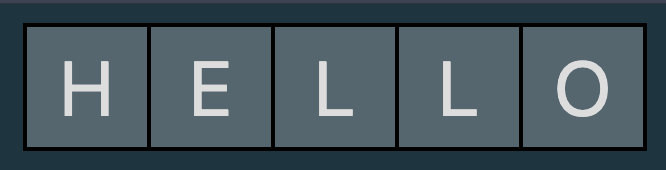

# Single Word "Crossword" Puzzle

This is a project to create a simple, framework-less solution to having a "daily clue" type puzzle easily embedded in a website.

The core functionality lies in `src/index.ts`, the rest of the project largely serves as a demo.

## typescript code

### generateInteractiveCrossword

This function looks for an element with the id "crossword-container" and creates the html elements to generate the answer box which looks like the following:



```ts
export const generateInteractiveCrossword = (
  answerLen: number,
  {
    cellColor = "#516770",
    focusColor = "#695170",
  }: {
    cellColor?: string;
    focusColor?: string;
  } = {}
): { container: HTMLDivElement, getUserInputHash: () => number } => {
   ...
}
```

`answerLen` is, as you might imagine, the length of the answer, and is the number of cells that will be produced. Then we have an options object which allows you te easily change which colors the cells will use.

There's two returns, `container` is just the `<div>`, in case you need to play with it. And `getUserInputHash` is a function that returns the `fnv32a` hash of what is in the `input` elements within the cells.

### compareHashes

The other main important function is `compareHashes`. It takes in two functions, each of which return a number, the assumption is that this number is the hash of the `answer` and `user input` respectively. It also looks for the html element with the id `result` to print the results.

```ts
export const compareHashes = (
  getAnswerHash: () => number,
  getUserInputHash: () => number
) => {
  const resultDiv = document.getElementById("result") as HTMLElement;
  const answerHash = getAnswerHash()
  const userInputHash = getUserInputHash()
  if (userInputHash === answerHash) 
   ...
}
```

I'm using hashing here because otherwise someone could theoretically – depending on the implementation – look at the html source code in the browser to see the answer in plain text.

## demo and styling

I said above, the rest of this project largely serves as a demo. 